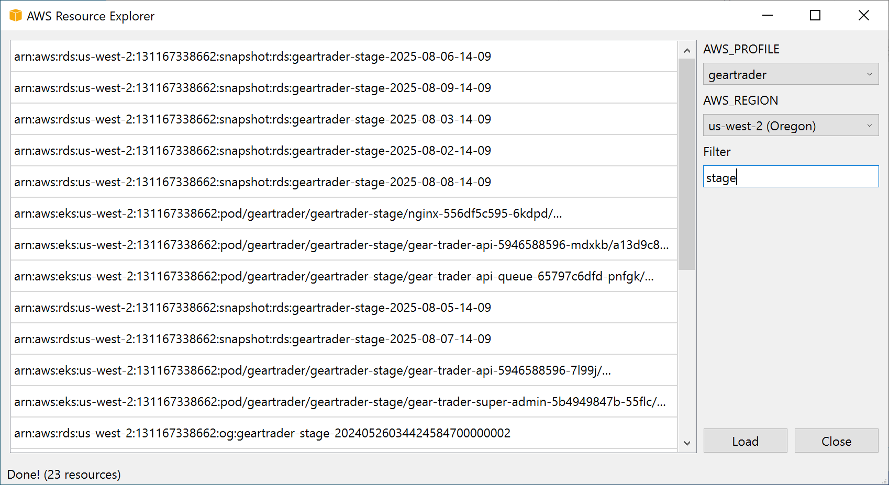

# AWS Resource Explorer

A modern, user-friendly desktop application built with PySide6 that provides a visual interface for exploring AWS resources across multiple regions and profiles. The application fetches AWS resources using the Resource Groups Tagging API with real-time filtering capabilities.




## ✨ Features

- 🔐 **Multi-Profile Support**: Switch between different AWS profiles seamlessly
- 🌍 **Multi-Region Exploration**: Explore resources across all AWS regions
- 🔍 **Real-time Filtering**: Filter resources instantly as you type
- ⚡ **Asynchronous Loading**: Non-blocking UI with progress indicators
- � **Complete Pagination**: Fetches ALL resources using AWS pagination
- 🚀 **Cross-Platform**: Works on Windows, macOS, and Linux

## 🚀 Quick Start

```bash
git clone https://github.com/mdminhazulhaque/aws-resource-explorer.git
cd aws-resource-explorer
python -m venv venv
source venv/bin/activate  # On Windows: venv\Scripts\activate
pip install -r requirements.txt
pyside6-uic form.ui -o ui_form.py
pyside6-rcc resources.qrc -o resources_rc.py
python window.py
```

## � Download

Pre-built binaries are available for immediate use without setting up Python:

- **Windows**: `aws-resource-explorer-windows.exe`
- **macOS**: `aws-resource-explorer-macos`
- **Linux**: `aws-resource-explorer-linux`

👉 **[Download from Releases](https://github.com/mdminhazulhaque/aws-resource-explorer/releases)**

Simply download the binary for your platform and run it directly. No Python installation required!

## �📖 Usage Guide

### Basic Workflow

1. **Launch** the application
2. **Select** your AWS profile from the dropdown
3. **Choose** the target AWS region
4. **Click Load** to fetch resources (all resources will be loaded using pagination)
5. **Filter resources** using the search box for real-time filtering
6. **Browse** through your filtered AWS resources

### Real-time Filtering

The application includes a powerful filtering feature:
- **Instant Search**: Type in the filter box to see results immediately
- **Case-Insensitive**: Search works regardless of letter casing
- **Substring Matching**: Finds resources containing your search term anywhere in the ARN
- **Clear Filter**: Delete search text to show all resources again

**Filter Examples**:
- Type `s3` to see only S3 buckets
- Type `us-east-1` to see resources in that region
- Type `lambda` to find Lambda functions
- Type part of an account ID to filter by account

### Keyboard Shortcuts

| Platform | Key | Action |
|----------|-----|--------|
| **macOS/Linux** | **Cmd+Q** | Quit the application |
| **Windows** | **Alt+F4** | Quit the application |

## 📄 License

This project is licensed under the MIT License - see the [LICENSE](LICENSE) file for details.

## 🙏 Acknowledgments

- **[PySide6](https://pypi.org/project/PySide6/)** - Python Qt bindings
- **[Boto3](https://boto3.amazonaws.com/)** - AWS SDK for Python
- **AWS Resource Groups Tagging API** - Resource discovery service

## 📞 Support

If you encounter any issues or have questions:
1. Search existing [Issues](https://github.com/mdminhazulhaque/aws-resource-explorer/issues)
2. Create a new issue with detailed information

---

**Made with ❤️ for the AWS community**
