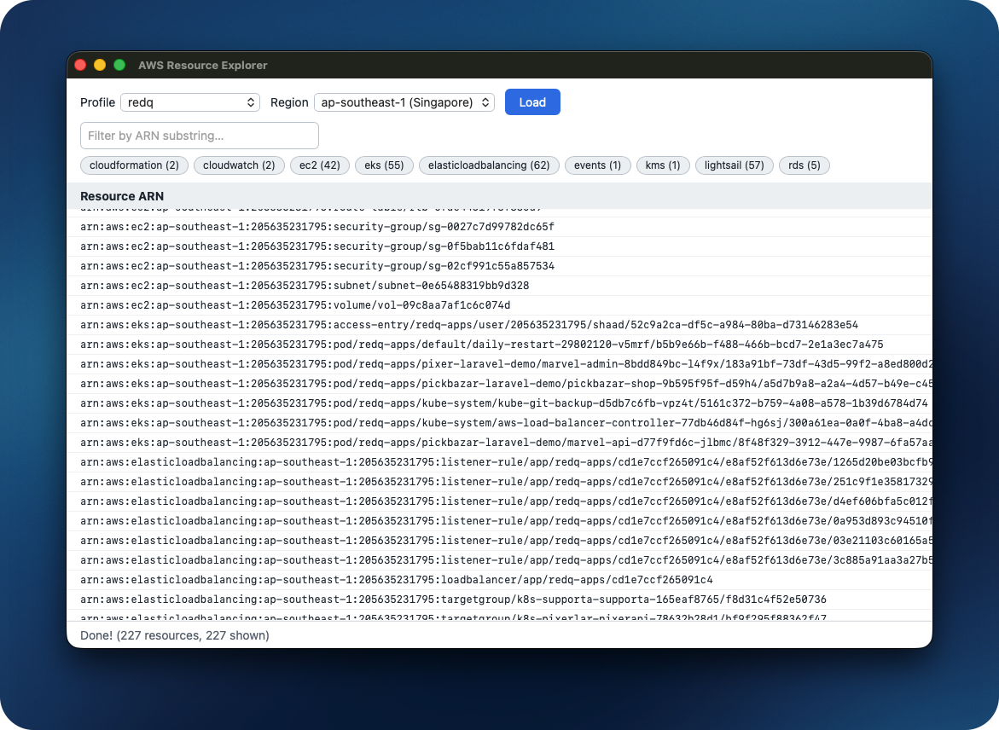

# AWS Resource Explorer

A lightweight desktop app for exploring AWS resources across profiles and
regions, built with [Deno](https://deno.com) and a native OS webview.
Resources are fetched with the AWS Resource Groups Tagging API and filtered
instantly in the UI.



## Features

- **Multi-profile** — pick any profile from `~/.aws/config` / `~/.aws/credentials`
- **Multi-region** — explore any AWS region
- **Full pagination** — loads *all* resources, with a live running count
- **Instant filtering** — case-insensitive substring search over ARNs
- **Service facets** — one-click chips (`s3`, `lambda`, …) with counts,
  combinable with the text filter
- **Cancellable loads** — stop a long fetch mid-flight
- **Native window** — a single Deno process, no Electron

## Requirements

- [Deno](https://docs.deno.com/runtime/getting_started/installation/) 2.0+
- AWS credentials configured (`aws configure` or SSO)

## Run

```bash
git clone https://github.com/mdminhazulhaque/aws-resource-explorer.git
cd aws-resource-explorer
deno task start
```

The first run downloads dependencies and the webview native library.

## Development

```bash
deno task serve   # server only — open the printed URL in a browser
deno task test    # run the test suite
```

## Usage

1. Select an AWS **profile** and **region**
2. Click **Load** — all resources are fetched with live progress
3. Narrow results with the **filter box** and/or **service chips**
4. Click the column header to sort; click **Cancel** to stop a load

## License

MIT — see [LICENSE](LICENSE).
