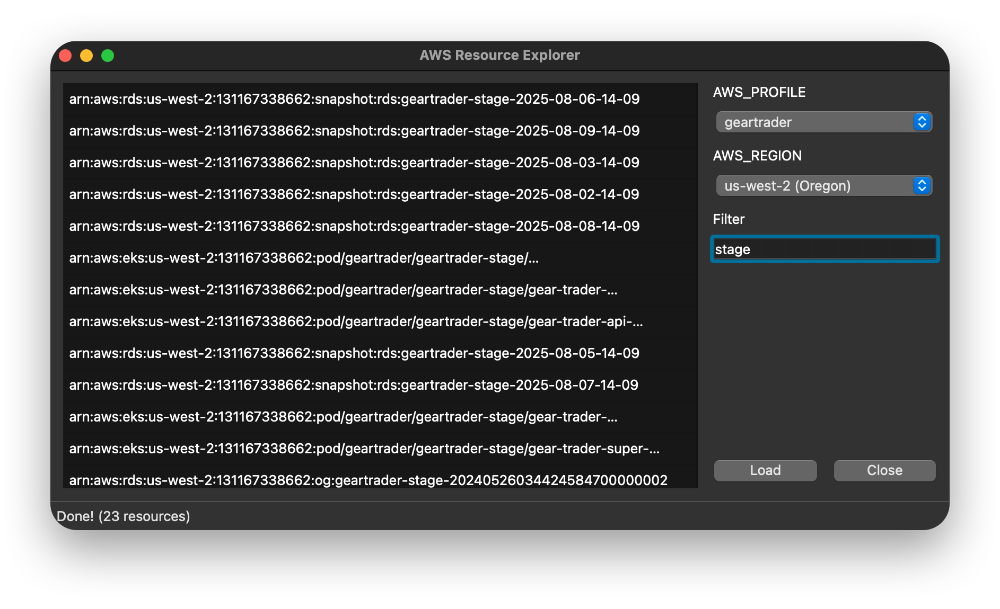

# AWS Resource Explorer

Navigate your AWS landscape with ease.

## Features

- Discover and list AWS resources across multiple services.
- Filter and search resources based on regions, and profiles.

## Prerequisites

- AWS CLI installed and configured.
- Python 3.8+ (if applicable for scripts or tools).
- Necessary IAM permissions to access AWS resources.

## Installation

TODO

## Usage

TODO

## License

TODO

## Contact

TODO